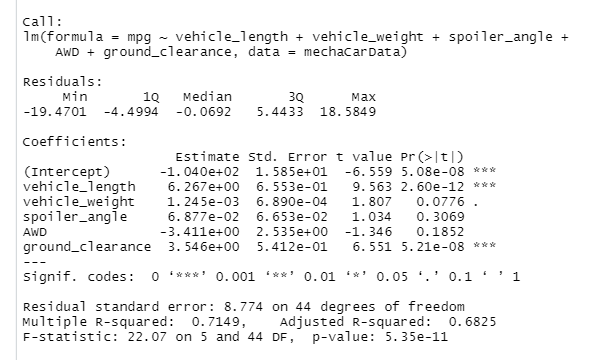
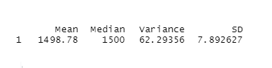
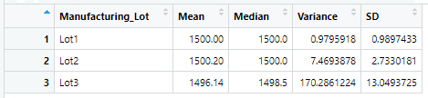

# MechaCar Statistical Analysis

## Project Overview

## Resources

## Linear Regression to Predict MPG
Using the Tidyr package's linear model function along with the summary method in R, the desired statistical summaries were easily obtained using the following codes.
 

- Some variables did provide a non-random amount of variance to the mpg values in the dataset.
- In particular, vehicle Length and ground clearance were statistically significant as their p-values fell below the .05 significance level. This indicates that vehicle length and ground clearance have impact on fuel efficiency (mpg).
- The slope of the linear model is not zero, according to the statistical summary results. Assuming we have a confidence level of 95%, the p-value is far below the corresponding .05 significance level and, therefore, we have sufficient statistical reasoning to reject the null hypothesis that the slope is zero.
- Regarding the predictive capability of the model, this linear model does indeed predict mpg of MechaCar prototypes fairly well considering the coefficient of determination (r-squared) produced a value of 0.7149. This means that the linear model explains about 71 percent of the variability, indicating our model does a decent job of predicting our dependent variable (mpg).

## Summary Statistics on Suspension Coils
By utitlizing "group by" and "summarize" methods in R, the variance, as well as a variety of other statistical metrics were easily calculated for PSI.
According to the first resulting "total_summary" table, the variance in PSI for all manufacturing lots as a whole appears within the desired range of 100 pounds per square inch (or less) with a value of approximately 62.29.
 

However, when we examine the variance in PSI grouped by each of the three lots in the "lot_summary" table, we find that not all of the results are within specifications. In particular, lot 3 exhibited a variance far above the 100 limit with a value of 170.29.
 

